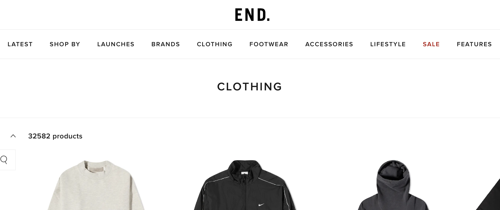
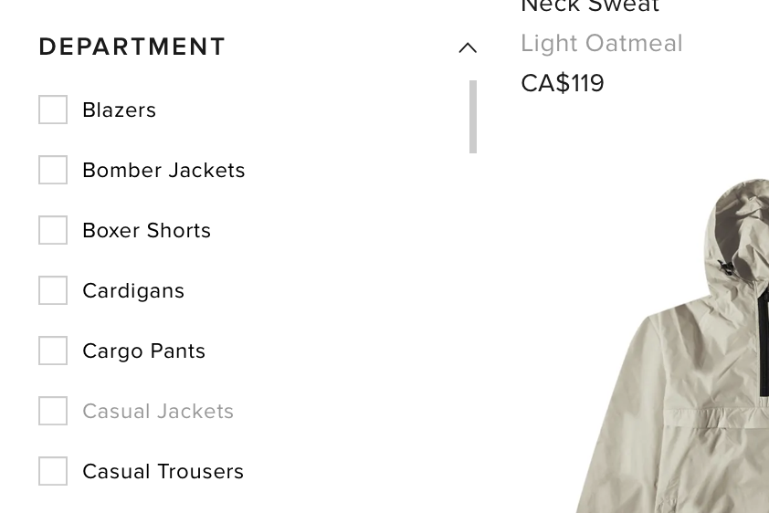
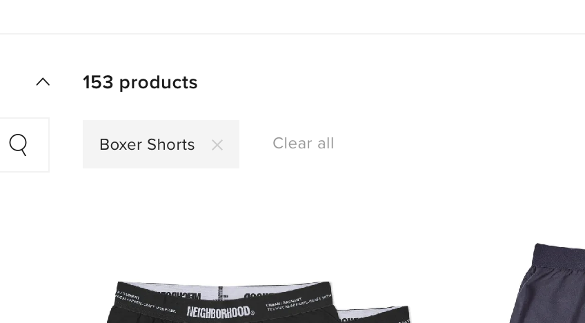
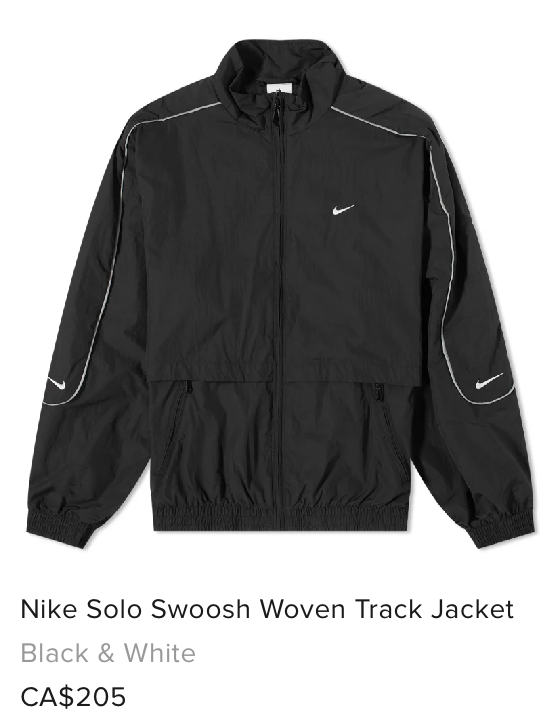
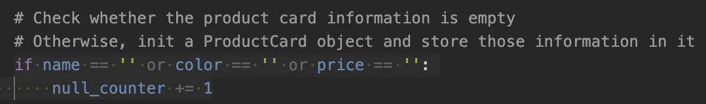
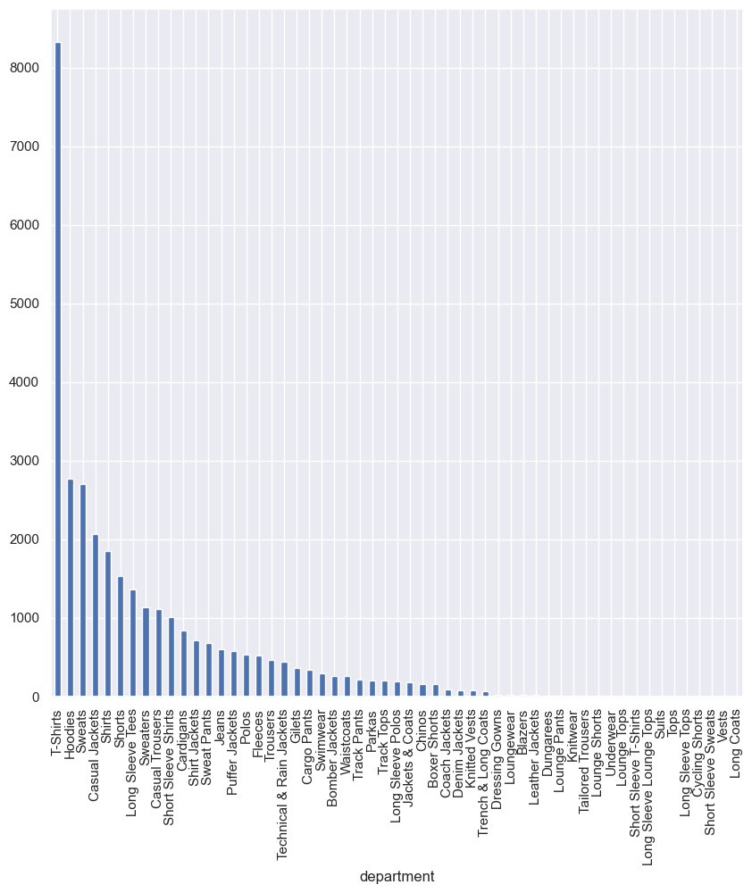
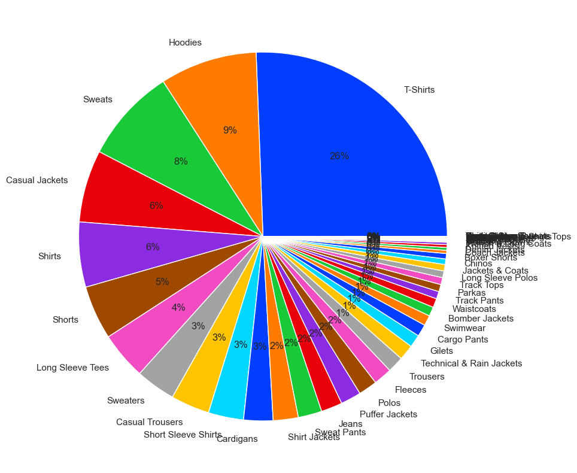
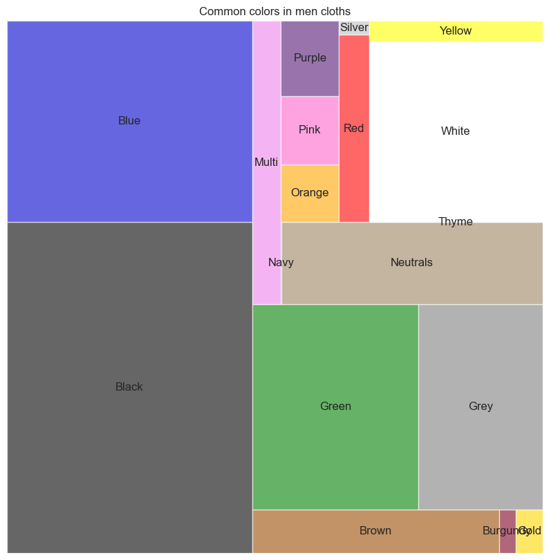
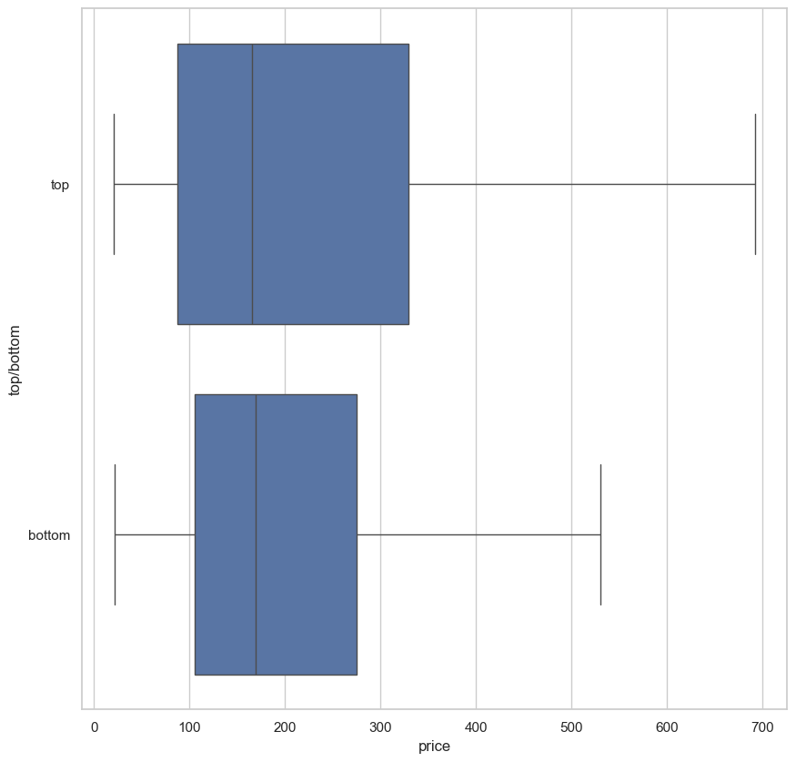

# web-scraping-practice

## Introduction

This project is a web scraping practice to web scrap the men's items on endclothing.com. In this web scraping, a total 32,542 of items have been scraped. This project mainly uses the selenium library to perform web scraping. Selenium can perform a variety of actions on web scraping, like scrolling., which helps render the hidden data. 

In the data analysis part, six analyses have been done with bar chat, pie chat, box plot, and treemap. The analysis mainly focuses on the relationship between categories of clothes and price, colors of clothes and price, and tops' price and bottoms' price.
## Prerequisites
The highlight of those essential libraries and tools
 - Jupyter notebook
 - selenium
 - concurrent.future
 - pandas
 - seaborn
 - matplotlib
 - squarify

Those needed library is written down into requirement.txt. 

## Web scrapping with selenium

In this project, selenium is chosen because there are some specific tasks are well performed by this library. Therefore, the following are some highlight about the web scrapping part of this project. 

### Using selenium Webdriver to perform scrolling
{:width="50%"}

"endclothing.com" is a dynamic website. Most of the information only appears when it shows on the window. Therefore, if we want to retrieve the hidden data of the webpage, scrolling actions are needed to let the webpage render that information. Selenium can execute JavaScript code to perform scrolling actions. Here is an example:

    depts  =  driver.find_elements(By.XPATH, '//div[@data-test-id="department_FilterItem"]') # Using XPATH to point to the department items
    for  i  in  range(len(depts)):
	    driver.execute_script("arguments[0].scrollIntoView();", depts[i]) # Use JavaScript syntax to scroll the element to render the text
	    depts_list.append(depts[i].text)
The above example uses `driver.find_elements()` to point to the desired element first. After that, `driver.execute_script("arguments[0].scrollIntoView();", depts[i])` perform the scrolling action until the bottom of the element.

### Using product count to calculate the number of pages

After having all the departments and color combinations of clothes, we need to know how many pages each combination has. Therefore, we have to get the product counter first, then divide it by 120, which is the number of products shown on each page. Then we can repeatedly request the webpage by only changing the "page" parameter like this: 

    driver.get(F"https://www.endclothing.com/ca/clothing?colour={color_name}&department={dept_name}&page={page_number}")

### Point to a product card first, then point to the useful information

When doing web scrapping, there are many elements that share the same ID. Therefore, I try to point to the ID of each product card first. After receiving each product card, I point to the name, color, and price of each product card with the following code:
Point to each product card:

    product_cards  =  driver.find_elements(By.XPATH, '//a[@data-test-id="ProductCard__ProductCardSC"]')
    
    for  i  in  range(len(product_cards)):
	    driver.execute_script("arguments[0].scrollIntoView();", product_cards[i])

Point to the name, color, and price of the corresponding product card:

    for  product_card  in  product_cards:
	    name  =  product_card.find_element(By.XPATH, './/span[@data-test-id="ProductCard__PlpName"]').text
	    color  =  product_card.find_element(By.XPATH, './/span[@data-test-id="ProductCard__ProductColor"]').text
	    price  =  product_card.find_element(By.XPATH, './/span[@data-test-id="ProductCard__ProductFinalPrice"]').text
	    print(f"{product_index}, name: {name}, color: {color}, price: {price}")

### Check whether the product card information is empty

When doing the web scrapping, some unexpected elements pop out. These elements are blocking the information that we want to extract from the website. Therefore, after the web scrap information from a page, the value of name, color, and price need to be checked with the following code:

    if  name  ==  ''  or  color  ==  ''  or  price  ==  '':
	    null_counter  +=  1 
If the `null_counter` value is larger than one, it means that there are missing values for the corresponding page. Then the `page_number` will be minus 1 to perform web scrapping on that webpage again:

### Multithreading approach for scrapping

To web scrap all the combinations of departments and colors, there are 55x19, which is 1,045 combinations. Therefore, applying the multithreading approach can significantly reduce the web scrapping time. The multithreading approach is like this:

    import  concurrent.futures    
    import  urllib
    
    counter  =  0
    future_to_url  = []

    with  concurrent.futures.ThreadPoolExecutor(max_workers=10) as  executor:    
	    for  dept  in  depts_list:
		    for  color  in  colors_list:
			    print(f"dept:{dept}, color:{color}")
			    future_to_url.append(executor.submit(single_web_scrap, urllib.parse.quote_plus(color), urllib.parse.quote(dept)))
	    
	    data  = []
	    for  future  in  concurrent.futures.as_completed(future_to_url):
		    try:
			    data.extend(future.result())
		    except  Exception  as  exc:
			    print(exc)
The `max_worker` indicated the maximum number of threads in the thread pool. The upper limit of the number of threads didn't apply due to the network performance. 

For the full Jupyter notebook contain all the web scrapping process, please check out [here](web_scrapping.ipynb)

## Analyse the data after the web scrapping

Here are a few analyses that are done with the data scrapped from the endclothing.com:

 - Total number of men's items
 - Volume of each department of clothing
 - The ratio of the color of clothes
 - The median price of each department of clothes
 - The median price of the color category
 - The median price of the "top" clothing and "bottom" clothing

After analyzing that information, here are the three most interesting findings:

 1. "T-Shirts" is the most popular item listed on endclothing.com. It occupied 26% (8329) of all of the products (32542). Significantly much more than "Hoodies" (9%, 2771), and "Sweats" (8%, 2698) which followed as second and third place.
 
 
 2. The three most listed colors of cloth on endclothing.com are "Black" (9269), "Blue" (5629), and "Green" (3887).
 
 3. There is no significant difference in the median price between the top (165) and bottom (165).
 

For the full Jupyter notebook contain all the data analysis process, please check out [here](data_analysis.ipynb)

## Conclusion

This is a very interesting project to practice web scrapping skills in a real-world application. There serval unexpected difficulties occurred. 

For web scraping, it is much more difficult to do web scrapping on a dynamic website, which is a heavily JavaScript-oriented webpage. This requires doing more actions, like scrolling, to retrieve the specific data. Besides, for the multithreading process, due to the time limit, I didn't test the time difference between the single-thread approach and the multiple-thread approach. It's hard to say using more threads will let the web scrapping time drop linearly. 

For data analysis, the tag from the website may not be enough to do a more sophisticated analysis. For example, after adding "top" and "bottom" to the data, many more dimensions have been created. These data have very potential with more labels on them.